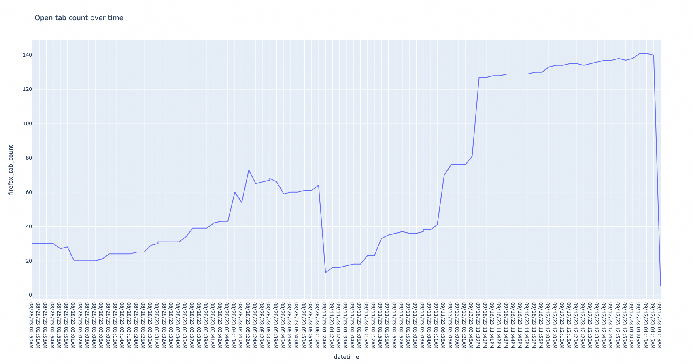

# Open Tab Tracker

This tool tracks the count of open tabs you have, and plots them over time.

When I'm working on a problem, or exploring a new idea, I'll open a new browser window and start searching. I'll discover related ideas that I should look into, new things to learn, and often, _more problems_ to work on. I thought it would be neat to be able to display this data visually.

This is what my open tab chart looked like while I was working on this project. You can see the points in time where I solved a problem I was working on _(sharp decrease in open tabs)_, and the points where I discovered new problems to solve _(sharp increase in open tabs)_.



## Installation

This package has not been released anywhere, so you'll have to run it by cloning the git repo:

```bash
$ git clone git@github.com:alichtman/open_tab_tracker.git
$ cd open_tab_tracker
$ pip3 install .
$ open-tab-tracker --install
$ open-tab-tracker --graph
```

## Usage

```bash
$ open-tab-tracker --help
Usage: open-tab-tracker [OPTIONS]

  Open Tab Tracker

Options:
  -a, --add-datapoint  Add a datapoint
  -i, --install        Install in crontab to run at startup
  --drop-database      Drop the database
  --graph              Opens the graph in a browser
  --print-db           Print the database
  --uninstall          Uninstall from crontab
  -v, --version        Print the version
  -h, -help, --help    Show this message and exit.

  See the project homepage for more details:
  https://github.com/alichtman/open_tab_tracker

```

## Support

| OS       | Firefox          | Chrome / Chromium  | Safari           |
|--------- |----------------- |------------------- |----------------- |
| Linux    | :white_check_mark:            | :x:    | :x:  |
| macOS    | :white_check_mark:            | :x:    | :x:  |
| Windows  | :x:  | :x:    | :x:  |

## Technical Details

-   Data is stored in a `sqlite3` database at `$XDG_DATA_HOME/open_tab_tracker.db`.
-   Firefox tab counts are derived from your firefox profile session backup recovery files. You can read the implementation details in [`browsers/firefox.py`](https://github.com/alichtman/open_tab_tracker/blob/main/open_tab_tracker/browsers/firefox.py).
