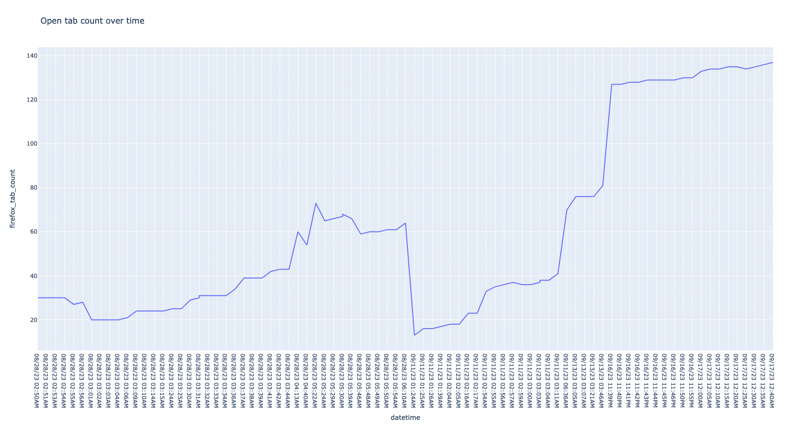

# open_tab_tracker.py

This tool tracks the count of open tabs you have, and plots them over time.



## Installation

This package has not been released anywhere, so you'll have to run it by cloning the git repo:

```bash
$ git clone git@github.com:alichtman/open_tab_tracker.git
$ cd open_tab_tracker
$ pip3 install .
```

## Technical Details

- Data is stored in a `sqlite3` database at `$XDG_DATA_HOME/open_tab_tracker.db`.
- Firefox tab counts are derived from your firefox profile session backup recovery files. You can read the implementation in [`browsers/firefox.py`](https://github.com/alichtman/open_tab_tracker/blob/main/open_tab_tracker/browsers/firefox.py).
